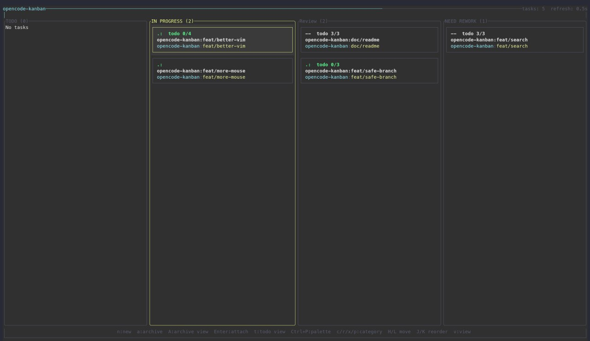
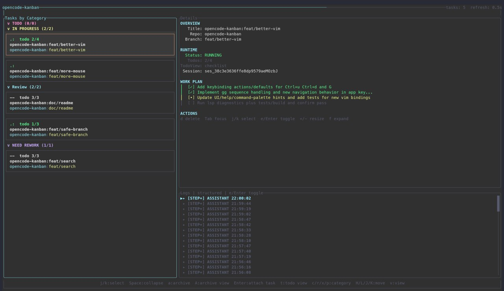

# opencode-kanban

<p align="center">
  
  
</p>

A Rust terminal kanban board for managing Git worktrees and OpenCode tmux sessions.

## Why this exists
Before creating this tool, I used [Agent of Empires](https://www.agent-of-empires.com/) — which is also a cool project with a similar purpose. However, I found its session management quite barebone as projects grew more complex. I was also inspired by [VibeKanban](https://www.vibekanban.com/). So you can think of this tool as a combination of both - managing your tasks in a kanban without leaving your favorate terminal environment.

What makes this different: I'm building this exclusively for opencode users. This lets me integrate deeply with opencode's API and offer unique features:

1. Stable session running state detection
2. Session TODO list with progress tracking
3. Running subagents and their TODO summaries (when applicable)
4. And more to come 🚀

## Prerequisites

- Unix shell
- `tmux` installed and available on `PATH` (required)
- `opencode` installed and available on `PATH` (recommended for attach/resume workflows)

## Quickstart (2 minutes)
1. Verify runtime tools:

   ```bash
   tmux -V
   opencode --version
   ```

2. Start the app:

   ```bash
   npx @qrafty-ai/opencode-kanban
   ```

3. In the UI:
   - Press `n` to create a task
   - Press `Enter` on a task to attach
   - Press `?` for built-in help
   - Press `q` to quit
4. In the attached tmux session:
   - Press `<prefix>+O` for help overlay
   - Press `<prefix>+K` to return to kanban session

If you start outside tmux, `opencode-kanban` auto-creates or auto-attaches to a tmux session named `opencode-kanban`.

## Installation

### npm

```bash
npm install -g @qrafty-ai/opencode-kanban
```

### AUR (Arch Linux)

```bash
yay -S opencode-kanban
# or
paru -S opencode-kanban
```

### Build from source

```bash
cargo build --release
./target/release/opencode-kanban
```

## First run

- Launch default project:

  ```bash
  opencode-kanban
  ```

- Launch a named project:

  ```bash
  opencode-kanban --project my-project
  ```

- Start with a theme preset:

  ```bash
  opencode-kanban --theme default
  opencode-kanban --theme light
  opencode-kanban --theme high-contrast
  opencode-kanban --theme mono
  opencode-kanban --theme custom
  ```

Each project uses its own SQLite file and board state.

## Core workflows

### Start a new task

1. Press `n` to open the new-task dialog.
2. Pick a repository and enter task details.
3. Press `Enter` to create.
4. Press `Enter` on the task card to attach to its tmux/OpenCode session.

### Resume previous work

1. Open the project (`Ctrl-p` to switch projects if needed).
2. Select the task.
3. Press `Enter` to attach to the existing session.

### Organize work on the board

- Move focus with `h`/`l` and select with `j`/`k`.
- Reorder/move task with `H`/`J`/`K`/`L`.
- Archive selected task with `a`.
- Open archive view with `A`.

## Keybindings cheat sheet

- `Ctrl-p`: switch project
- `n`: new task
- `Enter`: attach selected task
- `h`/`j`/`k`/`l`: navigate board
- `H`/`J`/`K`/`L`: move task
- `a`: archive selected task
- `A`: open archive view
- `?`: help overlay
- `q`: quit

For full, current bindings, use the in-app help overlay (`?`).

## Configuration

- Settings file: `~/.config/opencode-kanban/settings.toml`
- Project databases (Linux default): `~/.local/share/opencode-kanban/*.sqlite`

The app creates config/data files on demand.

### Theme configuration options

Theme values live in `~/.config/opencode-kanban/settings.toml`.

Top-level option:

- `theme`: `default` | `light` | `high-contrast` | `mono` | `custom`

When `theme = "custom"`, configure semantic tokens with these sections:

- `[custom_theme]`
  - `inherit`: `default` | `light` | `high-contrast` | `mono`
- `[custom_theme.base]`
  - `canvas`, `surface`, `text`, `text_muted`, `header`, `accent`, `danger`
- `[custom_theme.interactive]`
  - `focus`, `selected_bg`, `selected_border`, `border`
- `[custom_theme.status]`
  - `running`, `waiting`, `idle`, `dead`, `broken`, `unavailable`
- `[custom_theme.tile]`
  - `repo`, `branch`, `todo`
- `[custom_theme.category]`
  - `primary`, `secondary`, `tertiary`, `success`, `warning`, `danger`
- `[custom_theme.dialog]`
  - `surface`, `input_bg`, `button_bg`, `button_fg`

Example:

```toml
theme = "custom"

[custom_theme]
inherit = "light"

[custom_theme.base]
canvas = "#E2E7EE"
surface = "#ECF1F7"
text = "#222A3A"
text_muted = "#4E596D"
header = "#2F66BF"
accent = "#0E7490"
danger = "#B02E24"

[custom_theme.interactive]
focus = "#2F66BF"
selected_bg = "#D6DFED"
selected_border = "#477ACD"
border = "#A5B2C6"

[custom_theme.status]
running = "#278449"
waiting = "#AB781A"
idle = "#5D687A"
dead = "#B02E24"
broken = "#B02E24"
unavailable = "#B02E24"

[custom_theme.tile]
repo = "#086678"
branch = "#926614"
todo = "#4E596D"

[custom_theme.category]
primary = "#2F66BF"
secondary = "#AB501F"
tertiary = "#6949AB"
success = "#278449"
warning = "#AB781A"
danger = "#B02E24"

[custom_theme.dialog]
surface = "#ECF1F7"
input_bg = "#E0E6EF"
button_bg = "#CDD8E7"
button_fg = "#FFFFFF"
```

- Accepted color format: `#RRGGBB` (hex only).

## Troubleshooting

- `tmux is required but not available`:
  - Install tmux and confirm `tmux -V` works in the same shell.
- `OpenCode binary not found`:
  - Install OpenCode and confirm `opencode --version` works.
- Mouse scroll/click not working well in tmux:
  - Run `tmux set -g mouse on`.

## Local development

```bash
cargo test
cargo clippy -- -D warnings
cargo build --release
```

## Maintainers

Release and publisher setup docs are in `docs/releasing.md`.

## License

MIT
